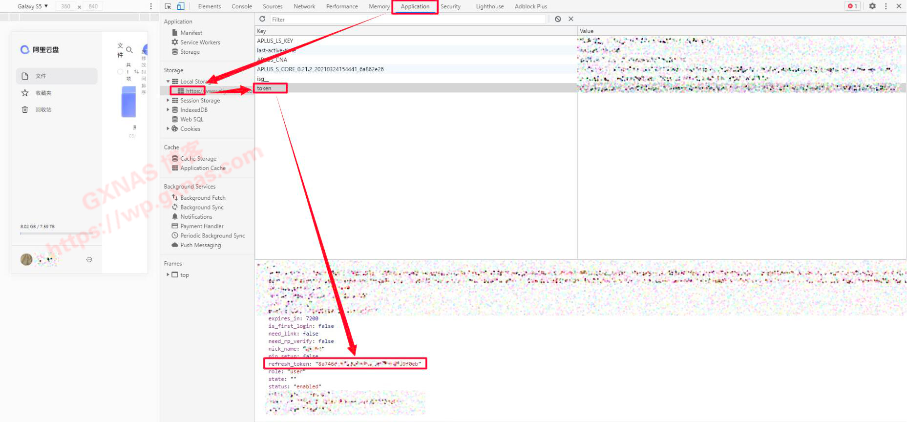
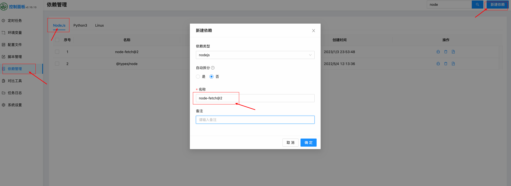

# autoSigninAliyun

阿里云盘的自动签到脚本，js

# 第一步：获取 refresh_token

1. 网页登录阿里云盘官网 https://www.aliyundrive.com/drive
2. 按 F12，进入开发者工具模式，在顶上菜单栏点 Application ，然后在左边菜单找到 Local storage 下面的 https://www.aliyundrive.com 这个域名，点到这个域名会看到有一个 token 选项，再点 token ，就找到 refresh_token 了
   

# 第二步：js 里的 refreshToeknArry 值改为 refresh_token 值，支持多账号

const refreshToeknArry = [
"",
""
]

# 第三步：通过 action 自动化执行代码

# 其他

1、要先下载依赖，依赖管理 - NodeJs - 新建依赖 - 名称输入：node-fetch@2
2、node-fetch@2 只是一个调用 http 的，如果实在版本差异导致调用失败的，可以换成其他，比如 axios

